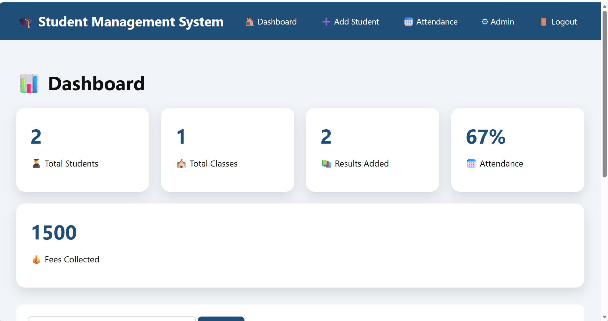

# Student Management System

A complete Django-based Student Management System designed to manage students, attendance, results, fees, profiles, ID cards, QR verification, and reporting.

## Features

### Student Management

- Add new students
- Edit student information
- Delete student records
- View student profiles
- Upload student photos

### Attendance Management

- Mark student attendance
- Track attendance percentage
- View student attendance
- Generate attendance reports

### Result Management

- Add student results
- Calculate percentage
- Generate grades
- View student results
- Generate result reports

### Fee Management

- Record student fees
- Track paid and unpaid fees
- View student fee records
- Generate fee reports

### Student ID Card

- Generate student ID cards
- Include:
  - Student photo
  - Student name
  - Roll number
  - Class
  - School information

### PDF Reports

- Generate student report cards
- Generate PDF reports
- Export reports

### Excel Export

- Export student records to Excel
- Manage student data in spreadsheet format

### QR Code Verification

- Generate QR codes for student verification
- Verify student information using QR codes

### Responsive Design

- Mobile-friendly dashboard
- Modern navigation
- Professional user interface

---

## Technologies Used

- Python
- Django
- HTML5
- CSS3
- Bootstrap
- JavaScript
- SQLite
- ReportLab
- QR Code Generation

---

## Screenshots

### Dashboard



### Dashboard 2


### Admin Portal


### Add Student


### Student Profile


### Student Report Card


### Student Attendance


### Mark Attendance


### Attendance Report


### Result Report


### Result and Fee of Student


### Fee Report


### Student Excel Sheet


---

## Installation

### 1. Clone the Repository

```bash
git clone https://github.com/AmberHafeez-eng/Student-Management-System.git
cd Student-Management-System
```

### 2. Create a Virtual Environment

```bash
python -m venv venv
```

### 3. Activate the Virtual Environment

#### Windows

```bash
venv\Scripts\activate
```

### 4. Install Dependencies

```bash
pip install -r requirements.txt
```

### 5. Run Database Migrations

```bash
python manage.py migrate
```

### 6. Create a Superuser

```bash
python manage.py createsuperuser
```

Follow the instructions to create your admin account.

### 7. Run the Development Server

```bash
python manage.py runserver
```

Open the following address in your browser:

```text
http://127.0.0.1:8000/
```

---

## Project Structure

```text
Student-Management-System/
│
├── dashboard/
├── students/
├── school_system/
├── media/
├── screenshots/
├── manage.py
├── db.sqlite3
├── requirements.txt
└── README.md
```

---

## Database

The project uses SQLite as the default database.

---

## Author

**Amber Hafeez**

GitHub: https://github.com/AmberHafeez-eng
